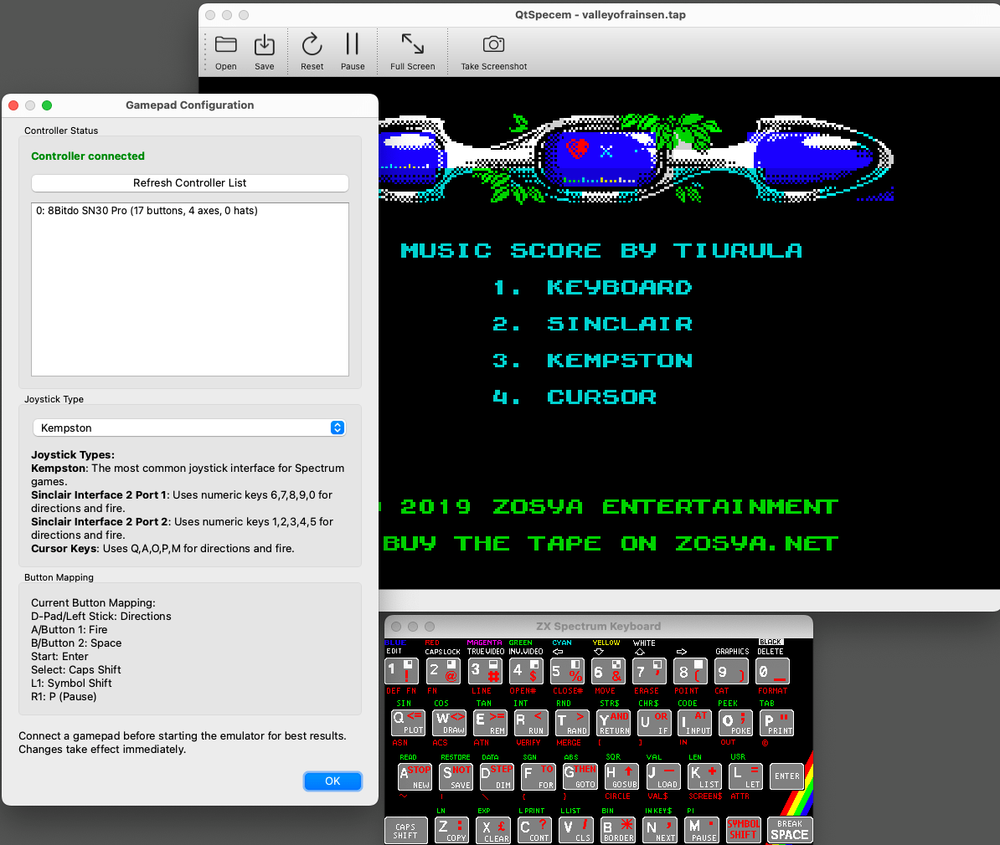

# QtSpecem

[](https://opensource.org/licenses/MIT)

A modern Qt6-based ZX Spectrum 48K emulator with a companion debugger, focused on accuracy and developer-friendly features.

*© 2020-2025 Rui Fernando Ferreira Ribeiro*  
*Z80A core emulation © 1991-2025 Rui Fernando Ferreira Ribeiro*



## Features

- **Accurate Z80 Emulation**
  - Ported from legacy WSpecem/emz80 emulators
  - Full support for documented and undocumented Z80 functionality (including Q/WZ/MEMPTR registers)
  - Successfully passes all 2023 ZXEALL and Z80TEST validation tests
  - Floating bus behavior implemented (passes Ramsoft's floatspy tests)

- **Video & Sound**
  - Real-time emulation with accurate timing
  - Timex video modes + ULAplus support
  - Standard Spectrum 48K sound

- **Input & Peripherals**
  - Full keyboard emulation
  - Gamepad support (Kempston interface currently implemented)
  - Early support for Timex cartridges

- **Developer Tools**
  - Companion Z80 debugger available at: https://github.com/ruyrybeyro/debugZ80
  - Memory dump and inspection features
  - Snapshot saving for debugging

## File Format Support

| Category | Supported Formats |
|----------|-------------------|
| Snapshots | SNA, Z80, SNX, SLT, SIT |
| Tapes | TAP |
| Memory Files | RAW, ZX, PRG, ACH, ROM, DAT, SCR, SEM |

## Usage

### Basic Operation
- Launch the emulator using `./QtSpecem` (Linux), `open QtSpecem.app` (macOS) or `QtSpecem.exe` (Windows)
- Drag and drop supported files into the emulator window

### Loading Files
- **TAP files**: After drag & drop, enter `LOAD ""` in the emulator
- **SNA/Z80/other snapshots**: Simply drag & drop to instantly load

### Controls
- **Kempston Joystick**: Use ALT + cursor keys or controller gamepad
- **Function Keys**:
  - **F2**: Save Z80 snapshots to `/tmp` (incremental filenames)
  - **F5**: Save TAP file dump to `/tmp` (incremental filenames)
  - **F12**: Save screen snapshot to `/tmp` (incremental filenames)

## Building from Source

### Prerequisites
- C++ development environment
- Qt6 development framework (6.2 or newer)
- SDL2 development libraries

### macOS

```bash
# Install dependencies
brew install qt@6 sdl2

# Clone repository
git clone https://github.com/ruyrybeyro/QtSpecem
cd QtSpecem

# Build command line or load QtSpecem.pro into Qt Creator
# Command line:
qmake    # or ./do_qmake
make

# For deployment as self-contained executable
macdeployqt QtSpecem.app
```

### Linux (Red Hat based)

```bash
# Install dependencies
sudo dnf install epel-release git
sudo dnf groupinstall "C Development Tools and Libraries"
sudo dnf install SDL2 SDL2-devel mesa-libGL-devel
sudo dnf install qt6-qtbase qt6-qtbase-devel qt6-qtdeclarative qt6-qtdeclarative-devel qt6-qtmultimedia qt6-qtmultimedia-devel

# Clone repository
git clone https://github.com/ruyrybeyro/QtSpecem
cd QtSpecem

# Build command line or load QtSpecem.pro into Qt Creator
# Command line:
qmake    # or ./scripts/do_qmake.sh
make
```

### Linux (Debian/Ubuntu based)

```bash
# Install dependencies
sudo apt install git build-essential libsdl2-dev
sudo apt install qt6-base-dev qt6-base-dev-tools qt6-declarative-dev qt6-multimedia-dev

# Clone repository
git clone https://github.com/ruyrybeyro/QtSpecem
cd QtSpecem

# Build command line or load QtSpecem.pro into Qt Creator
# Command line:
qmake    # or ./do_qmake.sh
make

# If icons don't appear
sudo apt install adwaita-icon-theme breeze-icon-theme
```

### Windows

```bash
# Prerequisites:
# - Qt framework with 64-bit MinGW GCC compiler
# - SDL2 development libraries
# - pkg-config for Windows

# 1. Download SDL2 from https://github.com/libsdl-org/SDL
#    (Version 2.x recommended)

# 2. Extract the 64-bit version to a folder (e.g., D:\Qt\projectos\QtSpecem\SDL2)

# 3. Download pkg-config for Windows and add it to system PATH

# 4. Set environment variable, for example:
#    PKG_CONFIG_PATH=D:\Qt\projectos\QtSpecem\SDL2\bin;D:\Qt\projectos\QtSpecem\SDL2\lib\pkgconfig

# 5. Clone repository
git clone https://github.com/ruyrybeyro/QtSpecem
cd QtSpecem

# 6. Build using Qt Creator or command line
#    - Qt Creator: Open the .pro file and build
#    - Command line: Use qmake and mingw32-make
```

### Cross-compiling for Windows (from Ubuntu)

This method is preserved for reference but may require updates for newer Qt versions.

```bash
# Add MXE repository
echo "deb [arch=amd64] https://pkg.mxe.cc/repos/apt focal main" | sudo tee /etc/apt/sources.list.d/mxe.list
sudo apt update
sudo apt install mxe-x86-64-w64-mingw64.static-qt6

# Clone and build
PATH=/usr/lib/mxe/usr/bin:$PATH
git clone https://github.com/ruyrybeyro/QtSpecem
cd QtSpecem
/usr/lib/mxe/usr/x86_64-w64-mingw32.static/qt6/bin/qmake
make
```

If successful, a self-contained binary will be created at `release/QtSpecem.exe`.

## Platform Compatibility

| Platform | Tested Versions |
|----------|----------------|
| macOS    | Sequoia |
| Linux    | Debian 12/13, Ubuntu 22.04+, Fedora 38+ |
| Windows  | Windows 10, Windows 11 |

## Known Issues

- Loading a TAP file introduces temporary patches to the ROM, which will cause ROM checksum validation to fail
- Some ULAplus applications may display color artifacts

## Project Vision

QtSpecem aims to serve as a comprehensive emulator framework for hosting independent utilities that run as separate programs on the same machine. The current implementation includes a command-line debugger, with plans to expand the toolkit for ZX Spectrum developers and enthusiasts.

## Contributing

Contributions are welcome! Please feel free to submit a Pull Request.

1. Fork the repository
2. Create your feature branch (`git checkout -b feature/amazing-feature`)
3. Commit your changes (`git commit -m 'Add some amazing feature'`)
4. Push to the branch (`git push origin feature/amazing-feature`)
5. Open a Pull Request

## License

This project is licensed under the MIT License - see the [LICENSE](LICENSE) file for details.

## Acknowledgments

- Thanks to all contributors and testers
- Thanks to Emanuel Santos for helping making it compile under Windows
- Original Z80 documentation authors
